# **T1A3 - Terminal Application Timothy Nguyen**

## **Table of contents**
- [**T1A3 - Terminal Application Timothy Nguyen**](#t1a3---terminal-application-timothy-nguyen)
  - [**Table of contents**](#table-of-contents)
  - [**Links (R4)**](#links-r4)
  - [**Styling Conventions (R5)**](#styling-conventions-r5)
  - [**Overview**](#overview)
  - [**Flow Diagram**](#flow-diagram)
  - [**Features (R6)**](#features-r6)
    - [**Feature 1 - Deposit Money**](#feature-1---deposit-money)
    - [**Feature 2 - Enter Bet Amount**](#feature-2---enter-bet-amount)
    - [**Feature 3 - Slot Randomisation and Spinning Animation**](#feature-3---slot-randomisation-and-spinning-animation)
    - [**Feature 4 - Check Win then Pay Winnings**](#feature-4---check-win-then-pay-winnings)
  - [**Implementation Plan (R7)**](#implementation-plan-r7)
  - [**Test Cases (R15)**](#test-cases-r15)
  - [**Deployment**](#deployment)
  - [**Help Documentation (R8) (R17)**](#help-documentation-r8-r17)
  - [**References/Attributions (R3)**](#referencesattributions-r3)

## **Links (R4)**

- [Github Repo](https://github.com/timmywebdev/TimothyNguyen_T1A3)
- [Slide Deck Presentation link - Youtube]()
- [Slide Deck PDF]()

## **Styling Conventions (R5)**

- PEP 8 – Style Guide for Python Code (<https://peps.python.org/pep-0008/>)

## **Overview**

This is a slot machine that runs inside the terminal.
When the game first runs, a welcome landing screen is displayed. Once the landing screen has passed, the game layout with deposit prompt will be outputted.
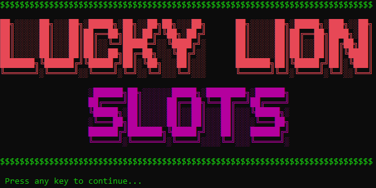
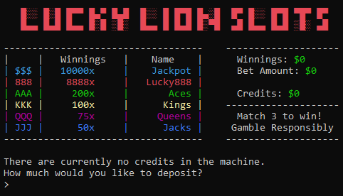

After a deposit has been taken, a new prompt will be displayed to take a bet amount.
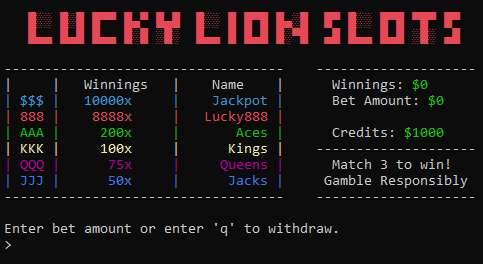

Once the bet amount has been entered, the slot machine will run (Picture below does not show reel animation). Once the slot reel finishes spinning, you will be shown a lose screen or a win screen depending on your outcome.
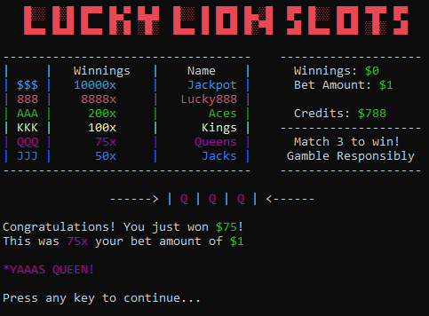
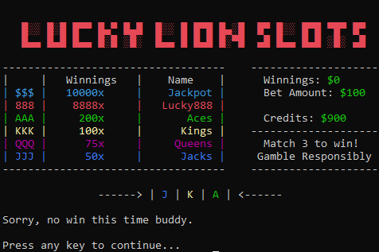

If you have credits left, you will return to the screen with the bet amount. You may enter 'q' here to withdraw your credits and end the game or you can bet and continue playing.
If you have entered 'q' you will see this screen.
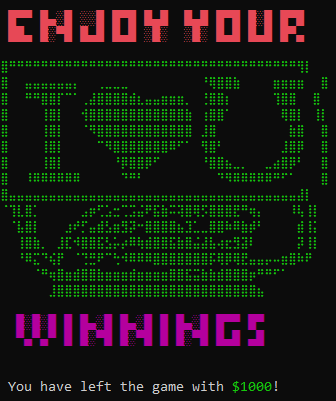

However, if you have run out of credits from gambling too much, you will see this screen.
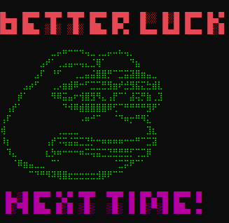

## **Flow Diagram**

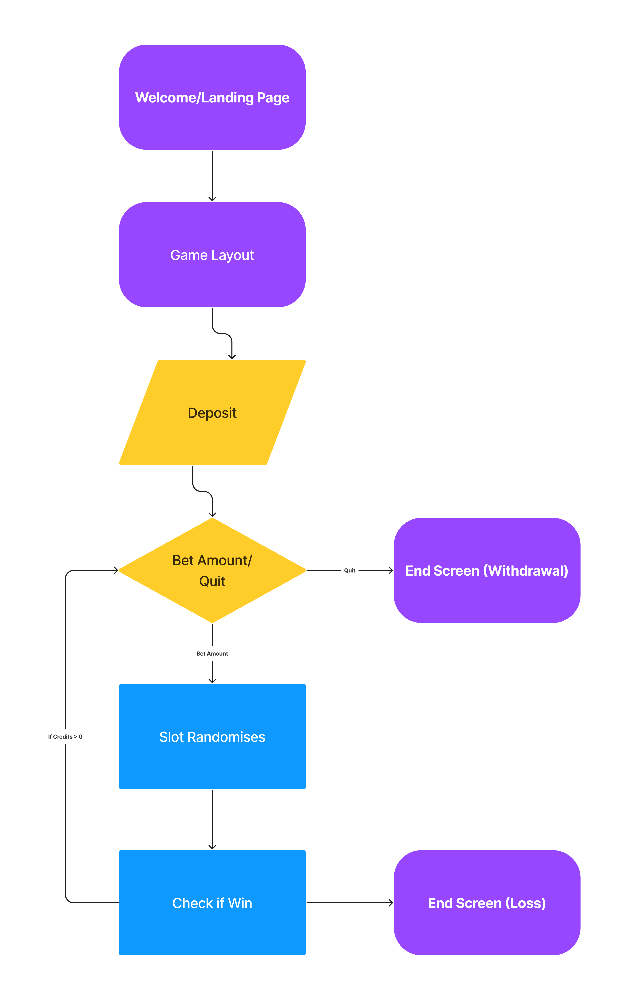

## **Features (R6)**

### **Feature 1 - Deposit Money**

The Deposit Money feature occurs when the game has just begun and there is no credits in the machine. The user will be able to input a money amount which will be stored under the `deposit` variable. Once the input passes through each of the conditions, then the `deposit` will be added to the `credits`. The variable that the credits fall under is in the `Game` class. The `Game` class handles multiple variables that are used throughout the code.

As `credits` is an integer value, there are a few errors that can occur when taking the value from the input variable. These errors will occur when the input consists of letters, symbols or even if it is blank. Here is the code for this feature.

``` Py
deposit = input(" There are currently no credits in the machine. \n How much would you like to deposit?\n > ")
if deposit.isdigit():
    deposit = int(deposit)
    if deposit >= 1:
        Game.credits += deposit
    else: 
        print(" Please enter a number larger than 0!")
        press_to_continue()
else:
    print (" Please enter a real number!")
    press_to_continue()
```

| Input| Error? | Implementation to fix |
|----------|--------|----------|
| not just digits | yes | I used deposit.isdigit() to make sure the input contains digits. This makes sure that turning the input into an integer will work. If the input does not only contain digits, it will print "Please enter a real number", and start the loop again. |
| an integer | no |  |
| less than or equal to 0 | yes | if the input consists of digits, and it is able to be converted to an int, then if the int(input) is less than or equal to 0, it will print " Please enter a number larger than 0!" and start the loop again. |

A few conditional control statements were used here to handle errors. These conditions included, if the input was only consisting of digits, and also if the converted int(input) was less than or equal to 0. This was very useful to handle all types of error inputs.

### **Feature 2 - Enter Bet Amount**

The Enter Bet Amount feature is similar to the Deposit Money feature. After the deposit has been made, and the variable `credits` in class `Game` has a value, a prompt will be made for the user to input the amount they would like to wager. When the user enters an input to the prompt, the input is stored in the variable `bet` and will be put under certain conditions that will determine what the output will be. The first condition will use the `.isdigit()` method to determine whether the input only contains digits. If this method passes, `bet` will then be converted to an integer so the code can continue. Once it is converted to an integer, the next condition will check whether the bet is more than 0 and is less than `credits` (since you cannot bet more than the credits that you have). If this condition is true, the bet will be subtracted from `credits` and the next feature to start the game will begin. However, if the value of the variable is above `credits` or less than or equal to 0, an error statement will be outputted, and the loop will break and start again. If the first condition of `.isdigit()` does not pass, then the next condition to check is the string that was given. If the string is a 'q' or 'Q', this will allow the user to terminate the game and withdraw their money. If the input is any other string except for "q" or "Q", then an error statement will be outputted, and the loop will break and start again.

Here is the code:

```python
if bet.isdigit():
    bet = int(bet)
    if bet <= Game.credits and bet > 0:
        Game.current_bet = bet
        Game.credits -= Game.current_bet
        press_to_lever()
        layout()
    else:
        print(f" You can only place a bet between $0 and ${Game.credits+1}!")
        press_to_continue()
        break
elif bet.lower() == "q":
    ending_win()
    exit()
else: 
    print(" That is not a valid number...")
    press_to_continue()
    break
```

| Input| Error? | Implementation to fix |
|----------|---------|----------|
| string(not 'q' or 'Q') | yes  | I used deposit.isdigit() to make sure the input contains digits. This makes sure that turning the input into an integer will work. If the input does not only contain digits, it will check the string for 'q' or 'Q' and start the loop again if not |
| an integer | no |  |
| less than or equal to 0 | yes | if the input consists of digits, and it is able to be converted to an int, then if the int(input) is less than or equal to 0, it will print " Please enter a number larger than 0!" and start the loop again. |
| more than credits | yes | if input is digits and is more than credits, error statement will be printed and the loop will start again |
| blank input | yes | input is not a digit or a 'q'/'Q', error statement is printed and loop will be started again |
| q or Q | no | user has decided to withdraw their credits and the game is terminated |

### **Feature 3 - Slot Randomisation and Spinning Animation**

After the game has received a `bet_amount` from the previous feature, it is now time to run the game. The first part of this feature is to gather the slot items into a list and then use the `Random` module to randomly choose from the list. The `Random` module is imported and `random.choice()` is used on the list. The function will then return a random choice from the list of slot items given.
This code displays getting the list and then randomising it:
```py
def reel_randomiser():
    symbols = [Items.jack, Items.jack, Items.jack, Items.jack, Items.jack,
                Items.queen, Items.queen, Items.queen, Items.queen, Items.queen,
                Items.king, Items.king, Items.king, Items.king, Items.king,
                Items.ace, Items.ace, Items.ace, Items.ace, Items.ace,
                Items.lucky888, Items.lucky888, Items.lucky888,
                Items.jackpot]

    return random.choice(symbols)
```

The second part of this feature is to output a slot machine that looks like it is spinning. This used two functions to operate. The first function is for the animation and the second function is to print the reels. The first function `spin_animation()` uses a `for` loop to run the `reel_randomiser()` function up to 30 steps. For the first 12 steps, all 3 reels are spinning. After `i` is more than 12, the first reel will stop running the `reel_randomiser()` function and the `variable(first)` will hold the final value of it. After `i` is more than 25, the second reel stops running the `reel_randomiser()` function and the `variable(second)` will hold the final value of it. Finally once `i = 30`, the third reel stops the `reel_randomiser()` function and the `variable(third)` will hold the final value. Once all 3 have completed, the function will return `(first, second, third)` values to the next function.
The code below shows the 'for' loop that was used:

```py
def spin_animation():
    for i in range(30):
        if i < 12:
            first = reel_randomiser()
            second = reel_randomiser()
            third = reel_randomiser()

            spinning(first, second, third)
        elif i < 25:
            first = first
            second = reel_randomiser()
            third = reel_randomiser()

            spinning(first, second, third)
        else:
            first = first
            second = second
            third = reel_randomiser()

            spinning(first, second, third)
    return (first, second, third)
```
Now that we have the `(first, second, third)` variables, we can print the slot machine. This is the final function of this feature and it is continually printed throughout the `spin_animation()` function to make the reel look like it is spinning. I used `.format` and `time.sleep()` method as well as `end=\r` to clear the screen after every print. This worked perfectly to animate the spinning of the reel. This function required the use of the time module as well to limit the refresh rate of the terminal and stop the screen flicker.

```py
def spinning(a, b, c):
    print('\t\t------> | {} | {} | {} | <------'.format(a, b, c,t=time.sleep(.15)), end='\r')
    # reduce flicker by maxing console refresh to 60fps
    time.sleep(1/60)
```

As this feature does not require a user input/interaction, the only errors that arose only occurred during the writing of the code. By the end of coding all the functions and joining it together and working out the errors, there is no way for the feature to fail anymore. The errors that occurred during the production of this feature stemmed from not linking the variables correctly when joining the functions but they have been amended now.

### **Feature 4 - Check Win then Pay Winnings**

The final feature of this application occurs once the previous feature is completed. Once the list of the final output of the animation is created, this function will be called to check the output. The `if` condition will check if the outputs `(a, b, c)` match each other. If `a, b, c` all match, the function will check which symbol it is. Depending on the symbol, a calculation is made to determine the `winnings` variable. The `bet_amount` is multiplied by the symbol's `value` and then stored in the `winnings` variable. The `winnings` variable is then added to the `credits` variable. A winning message will then be displayed with the winnings amount and the user will then be prompted back to bet again if they please.

```py
def check_win(a, b, c):
    if a == Items.jackpot and b == Items.jackpot and c == Items.jackpot:
        Game.winnings = Items.jackpot_value*Game.current_bet
        Game.credits += Game.winnings
        print(f"\n\n Congratulations! You just won ${Game.winnings}!")
        print(f" This was {Items.jackpot_value}x your bet amount of ${Game.current_bet}\n")
        print(f" *DING DING DING* JACKPOT!!!")
        press_to_continue()
    elif a == Items.lucky888 and b == Items.lucky888 and c == Items.lucky888:
        Game.winnings = Items.lucky888_value*Game.current_bet
        Game.credits += Game.winnings
        print(f"\n\n Congratulations! You just won ${Game.winnings}!")
        print(f" This was {Items.lucky888_value}x} your bet amount of ${Game.current_bet}\n")
        print(f" That is the Lucky888 bonus!")
        press_to_continue()
    elif a == Items.ace and b == Items.ace and c == Items.ace:
        Game.winnings = Items.ace_value*Game.current_bet
        Game.credits += Game.winnings
        print(f"\n\n Congratulations! You just won ${Game.winnings}!")
        print(f" This was {Items.ace_value}x your bet amount of ${Game.current_bet}\n")
        print(f" You are an Ace")
        press_to_continue()
    elif a == Items.king and b == Items.king and c == Items.king:
        Game.winnings = Items.king_value*Game.current_bet
        Game.credits += Game.winnings
        print(f"\n\n Congratulations! You just won ${Game.winnings}!")
        print(f" This was {Items.king_value}x your bet amount of ${Game.current_bet}\n")
        print(f" Eat and drink like a King!")
        press_to_continue()
    elif a == Items.queen and b ==Items.queen and c == Items.queen:
        Game.winnings = Items.queen_value*Game.current_bet
        Game.credits += Game.winnings
        print(f"\n\n Congratulations! You just won ${Game.winnings}!")
        print(f" This was {Items.queen_value}x your bet amount of ${Game.current_bet}\n")
        print(f" *YAAAS QUEEN!")
        press_to_continue()
    elif a == Items.jack and b == Items.jack and c == Items.jack:
        Game.winnings = Items.jack_value*Game.current_bet
        Game.credits += Game.winnings
        print(f"\n\n Congratulations! You just won ${Game.winnings}!")
        print(f" This was {Items.jack_value}x your bet amount of ${Game.current_bet}\n")
        print(f" Jack of all trades!")
        press_to_continue()
    else:
        print("\n\n Sorry, no win this time buddy.")
        Game.winnings = 0
        press_to_continue()
```

## **Implementation Plan (R7)**

Initially, the ideas were written up in a file in my directory. 
This is the [Ideas.pdf](docs/ideas.pdf) file.
Trello was then used to create a checklist of tasks with deadlines. Each task on the to-do list was also given a label which shows the priority of the task. Tasks to create each feature was made with checklists and deadlines to help with the implementation plan and deadline of the application. Below are some examples of my Trello Workspace in progress.

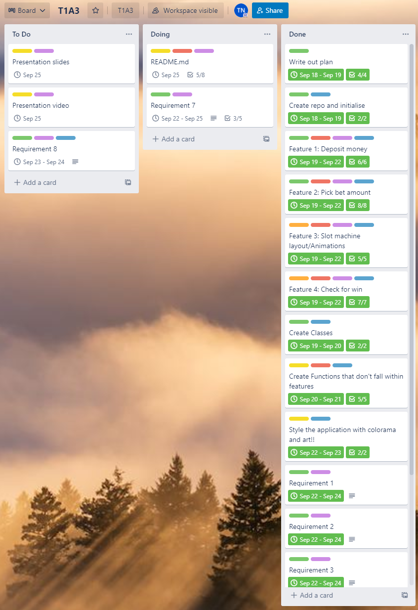

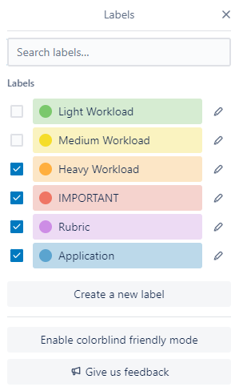

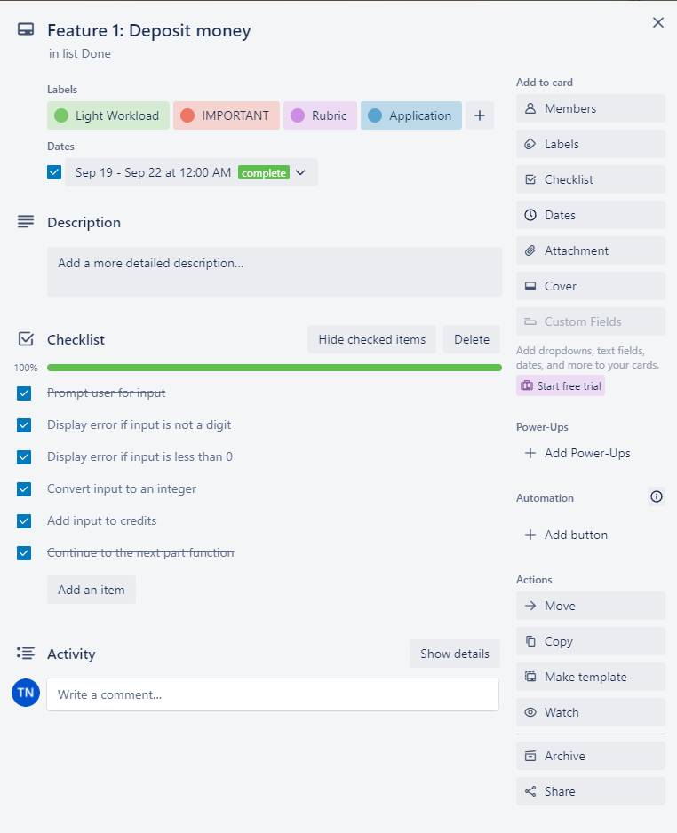

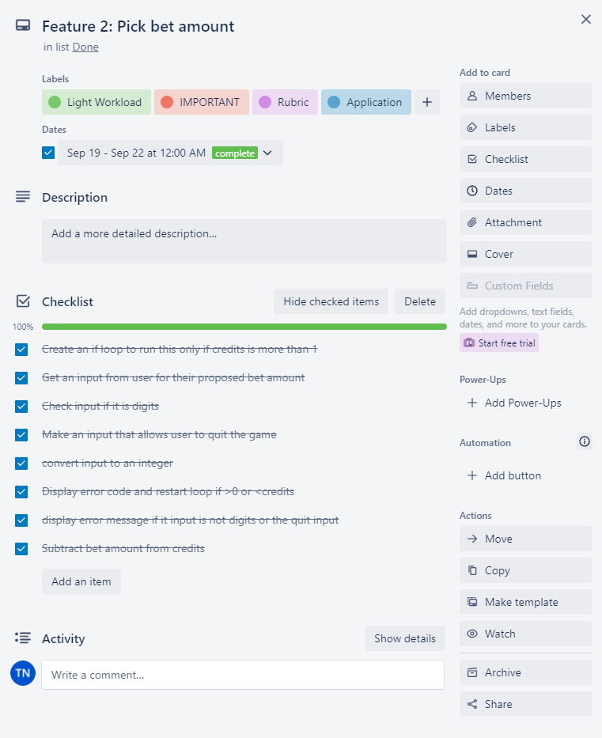


## **Test Cases (R15)**

| Test Case ID | Test Case Description | Test Steps | Test Data | Expected Results | Actual Results | Pass/Fail | Error Handling |
|------|------|------|------|------|------|------|------|
| TC01 | Check Deposit with Integer | 1. Get to deposit page 2. Enter integer | deposit = int() | Program should take the integer and continue running the code | As expected | Pass| nil |
| TC02 | Check Deposit with 'word' input | 1. Get to deposit page 2. Enter 'hello' | deposit = ‘hello’ | Program should print error message and return back to loop | As expected | Pass | nil |
| TC03 | Check Bet with Integer | 1. Get to bet page 2. Enter integer | bet = int() | Program should take the integer and continue running the code | As expected | Pass| nil |
| TC04 | Check Bet with 'word' input | 1. Get to bet page 2. Enter 'hello' | bet = ‘hello’ | Program should print error message and return back to loop | As expected | Pass | nil |
| TC05 | Check Bet with 'q' input | 1. Get to bet page 2. Enter 'q' | bet = lower.(q) | Should withdraw credits and display end screen | As expected | Pass | nil |
| TC06 | Press keys on keyboard while reel is spinning | 1. Start reel spin. 2. Press keys while spinning | key presses whilst function is running | Nothing should happen | The letters show up on the terminal while reel is spinning. This affected the `press_to_continue()` function.  | FAIL | Implemented `flush_input()` to make sure the inputed keypresses are flushed before `press_to_continue()` is called. |
| TC07 | Press enter on keyboard while reel is spinning | 1. Start reel spin. 2. Press 'enter' while function is running | Enter key input is recorded | Nothing should happen | The reel function gets printed multiple times while it is running | FAIL | Added warning to not press |

## **Deployment**

Deployment to [Github](https://github.com/timmywebdev/TimothyNguyen_T1A3)  

Source folder:  

/docs

- images/files found in README.md

/ppt

- Powerpoint Presentation PDF

/src

- .gitignore
- app.sh
- game.py
- main.py
- newpage.py
- pip_exec.py
- screens.py


README.md

requirements.txt

## **Help Documentation (R8) (R17)**

To install and run this application:

***On native Terminal:***

1. Open your command line and navigate to a directory you wish to run the program from.
2. Enter the following code into your command line:
   
    `git clone https://github.com/timmywebdev/TimothyNguyen_T1A3`
3. Now head to the source folder
4. To run the application, enter the following code into your command line:
   
    `./src/app.sh`
5. Follow the on screen instructions to play and enjoy!


***On Virtual Environment (Preferred if you do not want to install dependables locally):***

1. Install python3 if not already installed (<https://www.python.org/downloads>)
2. Open your command line and navigate to a directory you wish to run the program from.
3. Enter the following code into your command line:
  
    `git clone https://github.com/timmywebdev/TimothyNguyen_T1A3`
4. Activate virtual environment in your chosen path:
   
    `python3 -m venv /path/to/virtual/environment`

    then
  
    `python3 source /path/bin/activate`
5. Run application with following code:
   
    `./src/app.sh`
6. Follow the on screen instructions to play and enjoy!

For R17, a bash script (app.sh) has been created so it is alot easier to run the application. This script helps users to install dependencies automatically and then run the application. 

There are no system or hardware requirements for this application to run natively.

However, if run on the virtual environment it will be on python3. Here are the minimum requirements for Python3 installation:

Processors: Intel® Core™ i3 or AMD Ryzen 3250u CPU Operating System: Windows 7/10/11, Linux 64-bit RHEL or Mac OS X 10.11 & up RAM: 4GB of on-board system memory Disk Space: ~5GB of Hard Drive space (Lee, 2021)

## **References/Attributions (R3)**

- PEP 8 - Style Guide for Python Code (<https://peps.python.org/pep-0008/>)
- Pypi Art (<https://pypi.org/project/art/>)
- Pypi Colorama (<https://pypi.org/project/colorama/>)
- Ascii Art (<https://emojicombos.com/pepe-text-art>)
- Python Installation Requirement (<https://app.iclasspro.com/portal/sanfrancisco/news/15>)
- Using pip from your program (<https://pip.pypa.io/en/stable/user_guide/#using-pip-from-your-program>)